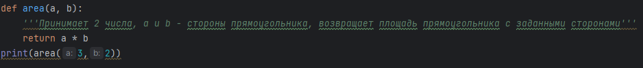
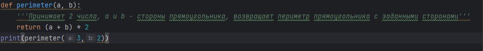

# Общее описание решения
Данный репотозиторый содержит 4 файла, которые содержат функции, с помощью которых можно находить площадь и периметр геометрических фигур.
# Описание каждой функции с примерами вызова
## circle.py - содержит 2 функции
1) area - возвращает площадь круга с заданным радиусом

Пример вызова функции:

Вывод:

2) perimeter - возвращает длинну окружности с заданным радиусом

Пример вызова функциии:

Вывод:

## rectangle.py - содержит 2 функции

1) area - возвращает площадь прямоугольника с заданными сторонами

Пример вызова функции:

Вывод:

2) perimeter - возвращает периметр прямоугольника с заданными сторонами

Пример вызова функции:

Вывод:

## square.py - содержит 2 функции

1) area - возвращает площадь квадрата с заданной стороной

Пример вызова функции:

Вывод:

2) perimeter - возвращает периметр квадрата с заданной стороной

Пример вызова функции:

Вывод:

## triangle.py - содержит 2 функции

1) area - возвращает площадь треугольника с заданной высотой и стороной

Пример вызова функции:

Вывод:

2) perimeter - возвращает периметр треугольника с заданными сторонами

Пример вызова функции:

Вывод:

# История изменения проекта с хешами комитов
1) Был добавлен новый файл rectangle.py  Хэш - a529b2f
3) Исправлена ошибка в функции perimeter в файле rectangle.py  Хэш - 10b16c7
4) Добавил комментарии к функция area, perimeter в файле circle.py  Хэш - b384e23
5) Добавил комментарии к функция area, perimeterв в файле rectangle.py  Хэш - 82714d6
6) Добавил комментарии к функция area, perimeter в файле square.py  Хэш - f20f772
7) Добавил комментарии к функциям area, perimeter в файле  triangle.py  Хэш - 0204ee5

## Unit Tests
Для проверки работы функций были созданы unit тесты. Для каждого файла был создан файл с названием unittests_"название фигуры".py.
В каждом файле содержатся тесты 3 типов:
- тест при правильном значение аргумента
- тест при агрументе другого типа
- тест при нулевом значении переданного аргумента
- ### circle_test.py
  пройдено 4 из 6 тестов 
- ### rectangle_test.py
  пройдено 3 из 6 тестов
- ### square_test.py
  пройдено 4 из 6 тестов
- ### triangle_test.py
  пройдено 3 из 6 тестов
  
| Тестируемый файл | Функция   | Входные данные | Результат |
|------------------|-----------|----------------|-----------|
| circle.py        | area      | 5              | passed    |
| circle.py        | area      | "5"            | failed    |
| circle.py        | area      | 0              | passed    |
| circle.py        | perimeter | 5              | passed    |
| circle.py        | perimeter | "5"            | failed    |
| circle.py        | perimeter | 0              | passed    |
| rectangle.py     | area      | 5,3            | passed    |
| rectangle.py     | area      | "5","3"        | failed    |
| rectangle.py     | area      | 0,0            | passed    |
| rectangle.py     | perimeter | 5,3            | passed    |
| rectangle.py     | perimeter | "5","3"        | failed    |
| rectangle.py     | perimeter | 0,3            | failed    |
| square.py        | area      | 5              | passed    |
| square.py        | area      | "5"            | failed    |
| square.py        | area      | 0              | passed    |
| square.py        | perimeter | 3              | passed    |
| square.py        | perimeter | "3"            | failed    |
| square.py        | perimeter | 0              | passed    |
| triangle         | area      | 5,3            | passed    |
| triangle         | area      | "5","3"        | failed    |
| triangle         | area      | 0,5            | passed    |
| triangle         | perimeter | 3,2,2          | passed    |
| triangle         | perimeter | "3","2","2"    | failed    |
| triangle         | perimeter | 0,0,2          | passed    |
